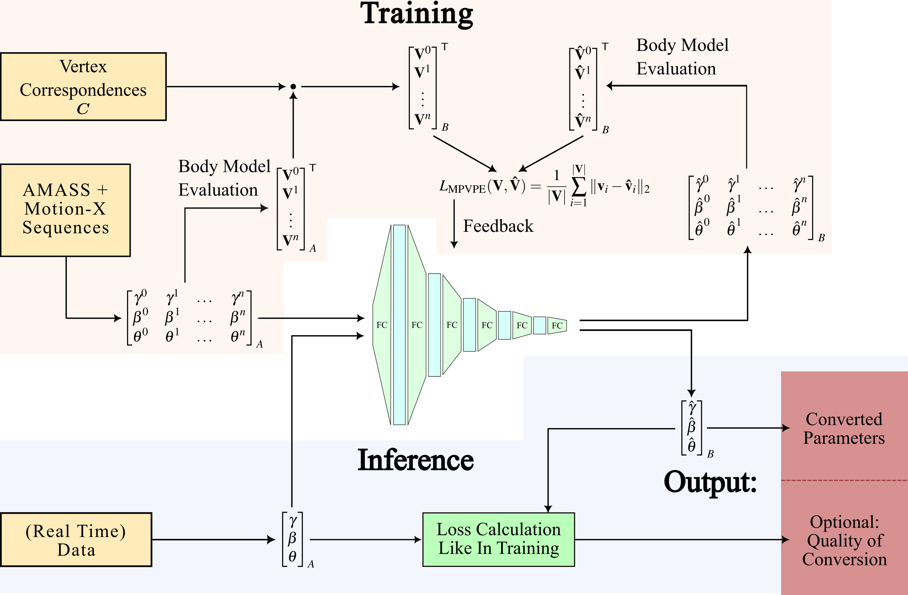

# Fast and Accurate Parameter Conversion for Parametric Human Body Models
[[Project Page](https://jufi2112.github.io/Fast_SMPL_Conversion/)]

We train fully-connected neural networks for the conversion between SMPL, SMPL+H, SMPL-X, SUPR, and STAR model parameters for male and female gender.

The following image shows our training and inference procedure:


## Licenses
This software is published under a MIT license. Small parts of the code are taken from PyTorch3D, which is published under the BSD license. The installation requires you to download software published by the Max Planck Institute which is available for non-commercial scientific work. Be sure to read the respective licenses before installation.

## Installation
1. Download this repository and its submodules using `git clone --recurse-submodules https://github.com/jufi2112/Fast_SMPL_Conversion`
2. Create a new anaconda or venv environment. Therin, use pip to install the requirements:
    - `pip install -r requirements.txt -c constraints.txt`
    - `pip install -r requirements_git.txt -c constraints.txt`
        - Note that this downloads our forked [SMPL-X](https://github.com/jufi2112/smplx), [SUPR](https://github.com/jufi2112/SUPR), and [STAR](https://github.com/jufi2112/STAR) packages, as we added some bug fixes and other improvements to the original packages.
3. Run `python scripts/mpi_loader.py`
    - This downloads code from the Max Planck Institute (from the original sources) and locally applies patches. The corresponding licenses can be found at `smpl_conversion/utils/mpi_code`

4. Lastly, install this package using `pip install .` (or `pip install -e .` for development) from within the directory that contains the setup.py script.

## Data Preparation
### Body Models, Transfer Files, and Vertex Segmentations
For many of our scripts, we expect all body models (which you have to download from their respective websites, please use the newest versions with 300 shape coefficients), transfer files (also downloadable from the SMPL-X website), and model vertex segmentations (download from [here](https://github.com/Meshcapade/wiki/tree/main/assets/SMPL_body_segmentation)) to reside in a common base folder. The content of this directory should look like this:
```
+---smpl
|       smpl_faces.npy
|       SMPL_FEMALE.pkl
|       SMPL_MALE.pkl
|       SMPL_NEUTRAL.pkl
|
+---smplh
|       SMPLH_FEMALE.npz
|       SMPLH_MALE.npz
|       SMPLH_NEUTRAL.npz
|
+---smplx
|       SMPLX_FEMALE.npz
|       SMPLX_FEMALE.pkl
|       SMPLX_MALE.npz
|       SMPLX_MALE.pkl
|       SMPLX_NEUTRAL.npz
|       SMPLX_NEUTRAL.pkl
|       smplx_npz.zip
|       version.txt
|
+---star
|       star_female.npz
|       star_male.npz
|       star_neutral.npz
|
+---supr
|       supr_female.npy
|       supr_female_constrained.npy
|       supr_male.npy
|       supr_male_constrained.npy
|       supr_neutral.npy
|
+--- segmentations
|       smpl_vert_segmentation.json
|       smplx_vert_segmentation.json
|
\---transfer
        smpl2smplh_def_transfer.pkl
        smpl2smplx_deftrafo_setup.pkl
        smplh2smplx_deftrafo_setup.pkl
        smplh2smpl_def_transfer.pkl
        smplx2smplh_deftrafo_setup.pkl
        smplx2smpl_deftrafo_setup.pkl
        smplx_mask_ids.npy
        smplx_to_smpl.pkl
```

### AMASS Data
Download the AMASS data from [here](https://amass.is.tue.mpg.de/) and put the gendered SMPL+H and SMPL-X archives into subfolders `<amass_root>/smplh` and `<amass_root>/smplx`. Then, run
```bash
python smpl_conversion/data/amass_preprocessing.py -i <amass_root> -o <data_root>
```
to extract the parameters and create train, validation, and test data from AMASS. For the splits, we follow the suggestions provided in the AMASS repository.
### Motion-X Data
Next, download the Motion-X dataset according to the documentation provided [here](https://github.com/IDEA-Research/Motion-X) and put the data into e.g. `motion_x/smplx_322`. Then, run
```bash
python smpl_conversion/data/motionx_preprocessing.py -i motion_x/smplx_322 -o <data_root>
```
to extract and process the Motion-X parameters.
### Train, Validation, and Test Data
Lastly, run
```bash
python smpl_conversion/data/amass_motion-x_combine.py --input-amass <data_root> --input-motionx <data_root> -o <data_root>
```
to merge AMASS and Motion-X data and save the resulting train, validation, and test data into `<data_root>`.
### Other Datasets
There are also preprocessing scripts for 3DPW and AGORA data in `smpl_conversion/data`.

## Training

1. For each training, create a directory `<base_dir>` where all data from this training run should be saved to.
2. Copy the configuration file of your training, e.g. `configs/combined_training.yaml`, into `<base_dir>/config/` and adapt the items inside the file to your liking
3. From `training/` directory, run `python -u combined_training.py --base-dir <base_dir>`
    - If you do not with to resume training from an existing checkpoint, additionally provide the `--disallow-checkpoint-loading` flag

## Training Visualization
In the `visualization` dir, there is a `train_visualizer.py` script which can be used to plot the training progression of a training log's `.pkl` file or a (not sanitized) `.ckpt` checkpoint file. Refer to the code inside of the `active_training_visualization.ipynb` file to see how to use it (or directly use the jupyter notebook file)

## Cleaning Up Checkpoints for Distribution
By default, the created checkpoints contain a lot of information which are necessary if you want to resume training from the checkpoint. If you, however, only plan to use the checkpoint to make predictions, you can reduce the file size by removing unnecessary information. You can do this by passing the checkpoint file to the `utils/checkpoint.py` script. This will also remove personalized information (e.g. paths on your system) from the checkpoint file. Note that you will not be able to continue training from such a sanitized checkpoint!

## Predicting
You will need a trained model (usually a `.ckpt` file, you can obtain them from our [project page](https://jufi2112.github.io/Fast_SMPL_Conversion/)). You can use the `CombinedPredictor` class from `inference/combined_prediction.py` to make predictions in your pipeline. You can either convert a single batch of data using the `.predict()` or a whole dataset using the `.predict_dataset()` methods. Make sure that the parameters you provide match the number of shape components and the pose rotation representation that is required by the checkpoint (the checkpoints we provide require 16 shape components and use rotation vectors as input and output rotation representation).

## Results
The below figure shows quantitative results of our conversion method:

Per-vertex position error comparison of our method to existing optimization-based conversion results (a and b: male and female STAR to SMPL conversion, c and d: male and female SMPL to SMPL+H conversion):

